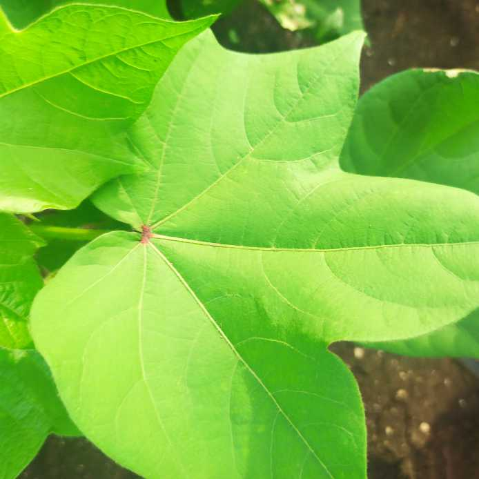
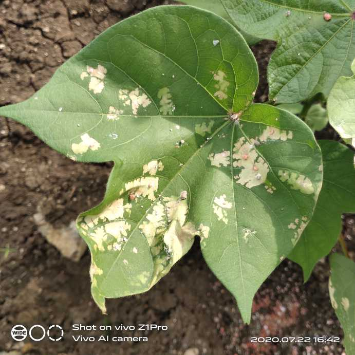

# cotton-leaf-classifier

### Alternate notebook can be found on my Kaggle profile : [Palash S](https://www.kaggle.com/raaavan/fine-tuning-the-cotton-leaf-disease-classifier)
## Data-set and Approach :
- Data-set is obtained from the Kaggle repository and it contains images of infected and fresh cotton leaves.

- For the classification of Infected/Fresh cotton leaves, a Convolutional Neural Network model is used, which will take raw images then converts them into normalized tensors as input to the Neural Network and at the end gives us a prediction class as an output. Several callback functions are also used for finding the optimal learning curve of the model as well as for saving the processing time.

- At the moment, the model only predicts if the leaf is infected or not but in the future, it will be extended to be able to predict the infection/disease category.

## Common Leaf Diseases :

- Ascochyta Blight forms lesions on cotyledons, leaves, stems, and bolls. Lesions on the cotyledons and leaves approach 2 mm.

- Bacterial Blight start as tiny water-soaked spots, and progress into characteristically angular shapes due to leaf veins limiting bacterial movement.

- Target Spot include brown lesions, sometimes approaching 2 cm (~1 inch) in diameter, exhibiting a series of concentric rings.

- Reddish lesions will occur during the early stages. As the disease progresses, the lesions enlarge and turn white to light brown in the center.

- Alternaria Leaf Spot forms lesions on senescing leaves that are brown with purple margins. As lesions expand they typically exhibit concentric zonation and the necrotic tissue will overlap with other lesions.

## Image Preview :

### Uninfected Cotton Leaf:

<!--  -->

- A cotton leaf with no signs of infection is pretty easy to find out.

### Infected Cotton Leaf:

- A cotton leaf shows above signs of decaying when the infection starts to grow.

## Model Summary :

- CNN Model : The proposed model is consist of 4 convolutional layers with a variation of filter and kernel size from 32 to 128 and (3,3) to (2,2) respectively.

- Activation Function : The entire model benefits from RELU activation function, except for the last output dense layers makes use of sigmoid activation function since it's a binary classification problem.

- Optimal Learning Rate : Optimal Learning Rate can be calculated by using tensorflow's integrated callback API called LearningRateScheduler(). As it appears, the model is able to learn swiftly when the learning rate is between lr = 0.01 to 0.001.

- Loss and Accuracy : To make precise predictions, first the optimal learning rate is calculated and then based on that the proposed model is trained. Upon evaluation on testing data, the proposed model yields the accuracy of 99.9% with a bare minimum loss of 0.006% which is a state-of-the-art Performance and in fact is able to classify cotton leaf correctly.
- Detailed Loss Curve: At the beginning, there was some fluctuation in val_loss however, the loss was always below 0.05 scale. Over the 50 iterations, the measured loss was 0.038 on validation data. Later the model was evaluated on the test data and the measured loss was 0.0062 which is way better than the expectation.

- Detailed Accuracy Curve : After 50 iterations, the measured accuracy was 0.983. On the other hand, as it can be guessed, since the loss evaluation on test data was 0.0062, the evaluated accuracy on test data was near around 0.999. Therefore, it can be concluded that the model is able to train and perform very well in order to predict the exact cotton leaf class.

